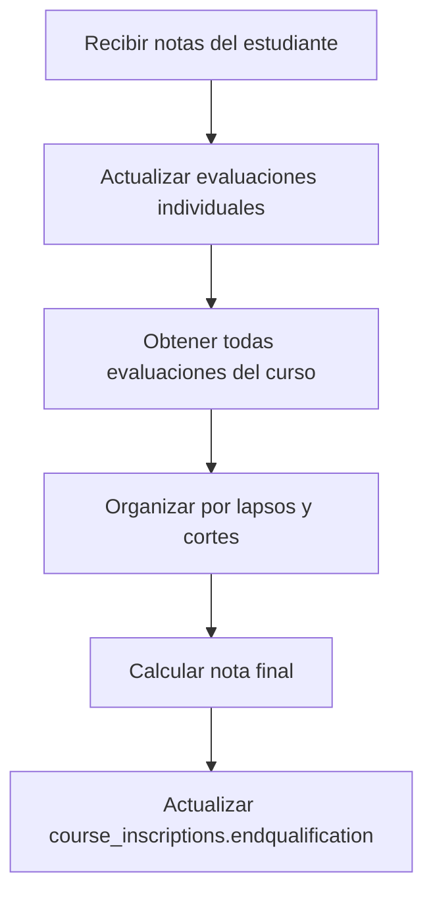

# Algoritmo de Cálculo de Calificaciones - Backend

Este módulo contiene el algoritmo centralizado para calcular notas de cortes, lapsos y calificación final de estudiantes en el backend.

## Características

- **Algoritmo idéntico al frontend**: Garantiza consistencia total
- **Types minimalistas**: Solo los datos necesarios para los cálculos
- **Funciones puras**: Sin efectos secundarios, fáciles de testear
- **Lógica consistente**: "No presentó" y "Sin calificar" valen 0

## Uso

```typescript
import { 
  calculateCourtGrade, 
  calculateLapseGrade, 
  calculateFinalGrade,
  EvaluationForCalculation,
  CourtForCalculation,
  LapseForCalculation
} from '@/core/evaluations';

// Ejemplo de uso
const evaluation: EvaluationForCalculation = {
  evaluationId: 1,
  percentage: 15,
  qualification: 18.5,
  didNotPresent: false,
};

const court: CourtForCalculation = {
  courtId: 1,
  evaluations: [evaluation],
};

const result = calculateCourtGrade(court);
console.log(result.grade); // Nota calculada
```

## Integración en Servicios

El algoritmo está integrado en `CourseSchoolYearService.updateStudentGrades()`:

1. **Actualiza evaluaciones individuales**
2. **Obtiene todas las evaluaciones del estudiante**
3. **Organiza por lapsos y cortes**
4. **Calcula nota final usando el algoritmo**
5. **Actualiza `endqualification` en `course_inscriptions`**

## Algoritmo

### Cálculo por Cortes
- Los porcentajes se normalizan dentro de cada corte
- Ejemplo: Tarea 1 (10%), Tarea 2 (15%) = 10/25 = 40%, 15/25 = 60%

### Cálculo por Lapsos
- Considera todas las evaluaciones del lapso con sus porcentajes originales
- Suma total siempre debe ser 100%

### Cálculo Final
- Promedio simple de los lapsos que tienen nota válida
- `(Lapso1 + Lapso2 + Lapso3) / cantidadLapsosConNota`

## Flujo de Actualización


